# CORO: Completely Rational $\mathrm{SO}(n)$ Orthonormalizer for Differentiable Pose Estimation and Learning

Authors: Jin Wu, Xieyuanli Chen, Boyu Zhou, Wenzheng Chi, Jun Ma, Zhijie Liu, Jiwen Lu, Shuzhi Sam Ge, Wei He

[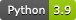](https://www.python.org/)
[](https://www.mathworks.com/products/matlab.html)
[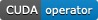](https://developer.nvidia.com/cuda-toolkit)
[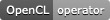](https://www.khronos.org/opencl/)
[](https://github.com/zarathustr/CORO/stargazers)
[](https://github.com/zarathustr/CORO/issues)

---

## Introduction

CORO is a completely rational orthonormalization framework on $\mathrm{SO}(n)$ for pose estimation, robotic calibration, manifold-aware learning, and hardware-oriented rotation projection. It maps unconstrained Euclidean matrices back to valid rotations using only additions, multiplications, and rational rescalings, avoiding SVD, eigendecomposition, square roots, and trigonometric evaluations in the core $\mathrm{SO}(n)$ update.

This repository follows the IJRR manuscript and collects four code paths: a Zhang-style parallel calibration solver with CORO projection, CUDA and OpenCL Deep CORO deployment operators for batched $SO(3)$ inference, and MATLAB scripts for proof verification and numerical stability checks.

### Key Features

* **Completely Rational $\mathrm{SO}(n)$ Orthonormalizer:** Dimension-agnostic update from $SO(3)$ to higher-dimensional $\mathrm{SO}(n)$ using cofactors, generalized cross-products, and rational normalization.
* **Global Stability Analysis:** MATLAB scripts verify the cofactor identities, Gram-domain recursions, $\mathrm{SO}(n)$ invariance, and contraction properties used in the proof.
* **Optimization-Oriented CORO Module:** CORO acts as a lightweight projector inside repeated pose-estimation and calibration loops.
* **Parallel Calibration Solvers:** Includes `ZNN-CORO` and `GNN-CORO` solvers for HEC, RWHE, and TFRWHEC calibration variants.
* **Deep CORO Learning and Circuitization:** Cascaded CORO layers form a rational $\mathrm{SO}(n)$ learning machine and motivate square-root-free quaternion/circuit blocks.
* **Multi-Platform Support:** Python, MATLAB, PyTorch C++/CUDA extension, and OpenCL runtime paths.

---

## Methodology & Visuals

### 1. The CORO Iterative Algorithm

For an input matrix $\mathbf{B}\in\mathbb{R}^{n\times n}$, the manuscript first applies a differentiable pre-scaling divisor

$$
\eta(\mathbf{B})=\frac{n+\|\mathbf{B}\|_F^2}{2n}.
$$

Then CORO updates each column by

$$
\mathbf{r}_{j,k}=\rho_k\left(\alpha\mathbf{r}_{j,k-1}+s_j\beta\mathbf{r}^{\otimes}_{j,k-1}\right),\qquad j=1,\dots,n,
$$

where $\mathbf{r}^{\otimes}_{j,k-1}$ is the generalized cross-product/cofactor correction for column $j$, $s_j$ is the orientation sign, and

$$
\rho_k=\frac{n-1}{n-2+\sum_{j=1}^n\|\mathbf{r}_{j,k-1}\|^2}.
$$

The stable working regime used throughout the paper is $\alpha,\beta>0$ with $\alpha+\beta=2$. Empirically, $\beta=1/(n-2)$ is a strong default for fast contraction, while $\alpha=\beta=1$ gives the balanced setting.

### 2. CORO for Parallel Calibration

The Python calibration package inserts CORO after each Euler step of a matrix-valued neural residual flow. The supported calibration equations are:

* HEC: $A_iX=XB_i$
* RWHE: $A_iX=YB_i$
* TFRWHEC: $A_iXB_i=YC_iZ$

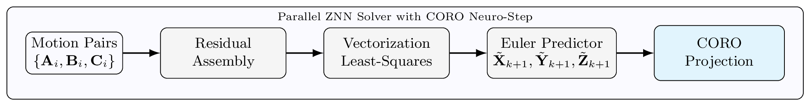

The parallel pose-estimator pipeline keeps the residual dynamics and the rotation projection cleanly separated. Motion tuples are first converted into the residual form for HEC, RWHE, or TFRWHEC; the residuals are then vectorized into a stacked least-squares problem whose solution gives simultaneous state derivatives. After the Euler predictor advances the unknown homogeneous transformations, CORO is applied to each rotational block as the neuro-step that returns the estimate to $SE(3)$.

The benchmark compares:

* **ZNN-CORO:** implicit Zhang neural dynamics plus CORO projection
* **GNN-CORO:** explicit gradient neural dynamics plus CORO projection

The direct `120`-trial Monte Carlo benchmark reports:

| Problem | ZNN-CORO mean rotation error | GNN-CORO mean rotation error | ZNN-CORO success rate |
| --- | ---: | ---: | ---: |
| HEC | `0.448 deg` | `9.538 deg` | `100.0%` |
| RWHE | `0.519 deg` | `10.243 deg` | `100.0%` |
| TFRWHEC | `0.888 deg` | `13.071 deg` | `100.0%` |

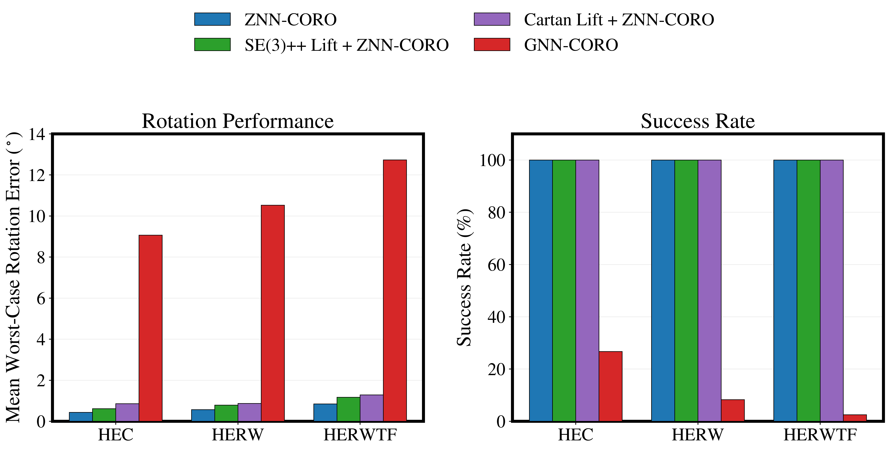

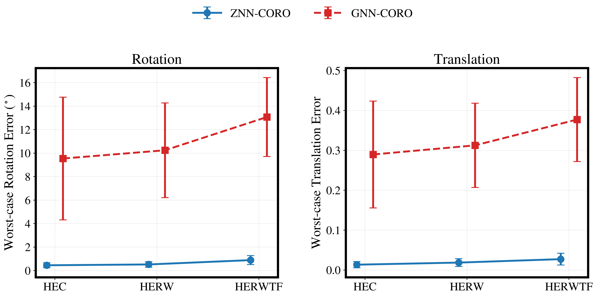

Pose error characteristics of direct and lifted parallel CORO calibration solvers.

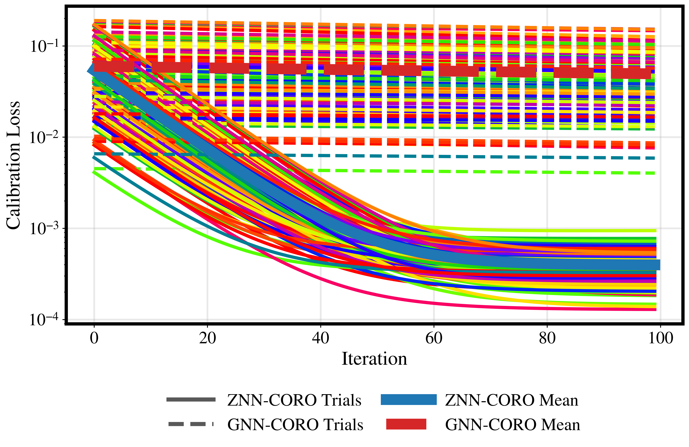

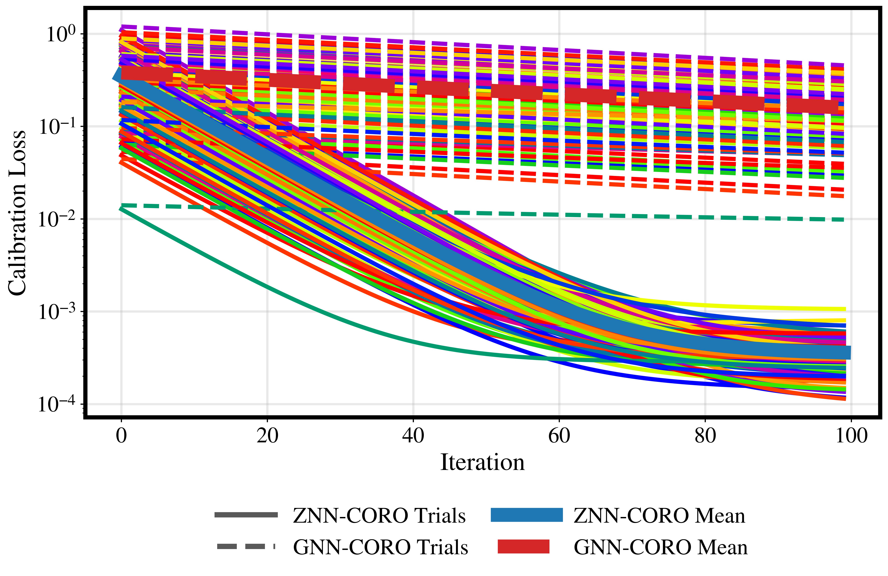

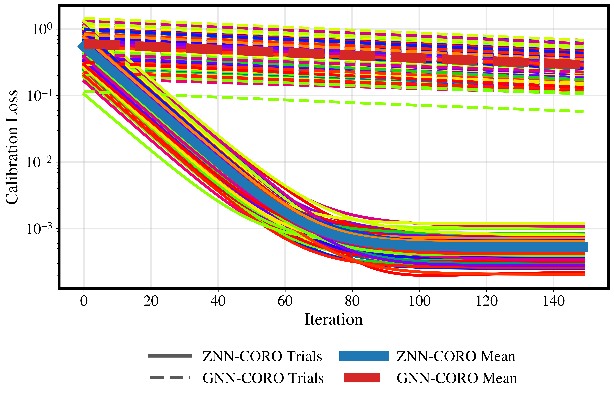

All-trial convergence curves for HEC, RWHE, and TFRWHEC.

### 3. Deep CORO Learning and Circuitization

The manuscript constructs a Deep CORO learning machine from a Euclidean embedding followed by rational CORO layers:

$$
\mathbf{x}_0=\mathrm{vec}(\mathbf{B}),\qquad
\mathbf{z}_0=\mathbf{W}_0\mathbf{x}_0+\mathbf{b}_0,\qquad
\mathbf{M}_0=\mathrm{mat}(\mathbf{z}_0),
$$

$$
\mathbf{M}_{\ell+1}=\rho_\ell\left(\alpha_\ell\mathbf{M}_\ell+\beta_\ell\zeta(\mathrm{cof}(\mathbf{M}_\ell))\right),
$$

where $\rho_\ell=(n-1)/(n-2+\|\mathbf{M}_\ell\|^2)$. The trainable coefficients are parameterized by $\beta_\ell=2\sigma(\theta_\ell)$ and $\alpha_\ell=2-\beta_\ell$, preserving $\alpha_\ell+\beta_\ell=2$.

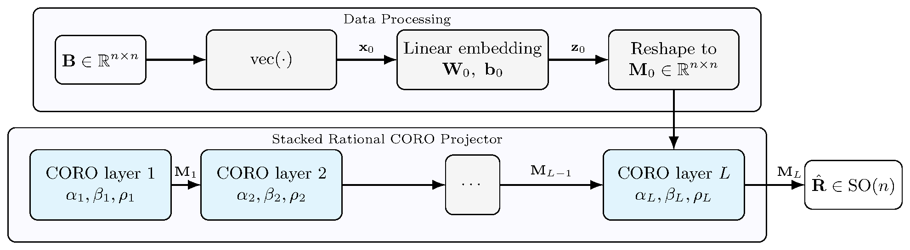

Deep CORO uses a two-stage architecture. The data-processing block vectorizes the observed matrix and learns a Euclidean embedding, while the stacked rational CORO projector performs layer-wise cofactor correction and rational normalization. This lets the front end absorb task-specific distortions and leaves the CORO stack to enforce the $\mathrm{SO}(n)$ geometry.

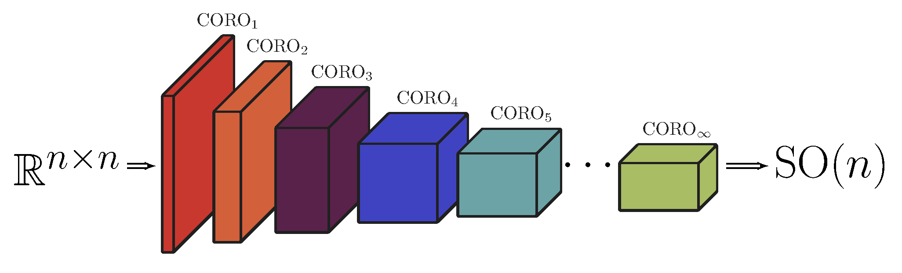

CORO-NN interprets each CORO update as a neural layer from $\mathbb{R}^{n\times n}$ toward $\mathrm{SO}(n)$. Cascading the layers forms a rational rotation-learning machine whose depth controls how many correction-and-normalization steps are available before the final manifold-constrained output.

The learning benchmarks in the manuscript show the strongest result from the deeper `Deep CORO (8)` head:

| Task | Strong baseline mean angle | Fixed CORO (4) mean angle | Deep CORO (8) mean angle |
| --- | ---: | ---: | ---: |
| Procrustes | `4.08 deg` Esteves-style lift | `4.25 deg` | `3.98 deg` |
| HEC Rotation | `19.27 deg` Esteves-style lift | `6.85 deg` | `4.10 deg` |
| Object Pose | `18.14 deg` Esteves-style lift | `20.51 deg` | `11.04 deg` |

The quaternion specialization gives a square-root-free rational normalizer:

$$
\mathbf{q}_k=\frac{5+\mathfrak{N}_{k-1}}{2+4\mathfrak{N}_{k-1}}\mathbf{q}_{k-1},\qquad
\mathfrak{N}_{k-1}=\mathbf{q}_{k-1}^\top\mathbf{q}_{k-1}.
$$

---

## Prerequisites

The code pack is organized for local Python/MATLAB use, with optional accelerator paths.

* **Python:** `3.9` for `CORO-parallel-pose-estimation`; `deep-CORO-OpenCL` supports `>=3.9,<3.13`.
* **MATLAB:** used for proof verification and publication-style plot regeneration.
* **CUDA/PyTorch:** optional, for the `deep-CORO-CUDA` extension.
* **OpenCL/PyOpenCL:** optional, for portable OpenCL inference experiments.
* **Dependencies:** NumPy, SciPy, pandas, Matplotlib, PyTorch, and PyOpenCL where applicable.

---

## Code Pack

```text
CORO/
  README.md
  figures/
  CORO-parallel-pose-estimation/
  deep-CORO-CUDA/
  deep-CORO-OpenCL/
  global-stability-proof/
```

* `CORO-parallel-pose-estimation/`: Python package for Zhang-style implicit neural calibration with CORO projection.
* `deep-CORO-CUDA/`: PyTorch C++/CUDA extension for batched Deep CORO inference on `3 x 3` matrices.
* `deep-CORO-OpenCL/`: OpenCL runtime, NumPy reference, and PyTorch reference module for portable deployment.
* `global-stability-proof/`: MATLAB verification suite for the CORO update law and proof identities.

---

## Python/CUDA/OpenCL/MATLAB Build & Run

Each command block below assumes the repository root as the current directory unless it explicitly changes into a subfolder.

### 1. Clone the repository

```bash
git clone https://github.com/zarathustr/CORO.git
cd CORO
```

### 2. Zhang ZNN + CORO parallel calibration

```bash
cd CORO-parallel-pose-estimation
python3.9 -m pip install -e .
python examples/run_coro_only_trials.py
```

To regenerate the manuscript-facing figures:

```bash
python examples/regenerate_publication_figures.py
```

For MATLAB plotting from saved CSV files:

```matlab
cd matlab_plots
run_coro_only_mc120_plots
```

### 3. Deep CORO CUDA operator

```bash
cd deep-CORO-CUDA
python -m pip install -e .
python tests/test_operator.py
python experiments/run_experiments.py --out results
```

If CUDA is installed but not detected during build:

```bash
FORCE_CUDA=1 python -m pip install -e .
```

To disable fast math:

```bash
CORO_NO_FAST_MATH=1 FORCE_CUDA=1 python -m pip install -e .
```

### 4. Deep CORO OpenCL operator

```bash
cd deep-CORO-OpenCL
python -m pip install -e .
pip install pyopencl
python scripts/list_opencl_devices.py
python experiments/run_experiments.py --out results_opencl
```

The OpenCL path is forward-only for deployment. Training should use the differentiable PyTorch reference module, then export learned `alpha` and `beta` arrays to the OpenCL runtime.

### 5. MATLAB proof and verification

Open MATLAB in `global-stability-proof/` and run:

```matlab
demo_verify_and_orthonormalize
```

This verifies the cofactor identities, Gram-domain inequalities, $\mathrm{SO}(n)$ invariance conditions, and numerical orthonormalization behavior used by the proof scripts.

---

## Main Output Files

The recommended calibration benchmark writes:

```text
CORO-parallel-pose-estimation/results/coro_only_mc120/
```

Key files:

* `overall_summary.csv`
* `hand_eye_trials.csv`
* `rwhe_trials.csv`
* `axbycz_trials.csv`
* `convergence_histories.csv`

The refreshed publication figures are mirrored in the root `figures/` folder:

* `figures/parallel_pose_estimator_pipeline.png`
* `figures/deep_coro_network.png`
* `figures/coro_nn_cascade.png`
* `figures/lifted_benchmark_summary.png`
* `figures/direct_error_characteristics.png`
* `figures/hand_eye_convergence_all_trials.png`
* `figures/rwhe_convergence_all_trials.png`
* `figures/axbycz_convergence_all_trials.png`

---

## Notes
**CUDA Runtime Comparison**

| Batch | Deep CORO reference | SVD projection | Faster method |
| ---: | ---: | ---: | --- |
| `32` | `4.48 ms` | `0.59 ms` | SVD projection |
| `128` | `3.30 ms` | `0.77 ms` | SVD projection |
| `512` | `3.58 ms` | `2.04 ms` | SVD projection |
| `2048` | `5.47 ms` | `7.99 ms` | Deep CORO reference, `1.46x` over SVD |

**OpenCL Reference CPU Runtime for 8 CORO Layers**

| Batch | NumPy Deep CORO | NumPy SVD projection | Faster method |
| ---: | ---: | ---: | --- |
| `32` | `0.507 ms` | `0.185 ms` | SVD projection |
| `128` | `0.539 ms` | `0.582 ms` | Deep CORO, `1.08x` over SVD |
| `512` | `0.779 ms` | `2.126 ms` | Deep CORO, `2.73x` over SVD |
| `2048` | `1.415 ms` | `14.053 ms` | Deep CORO, `9.93x` over SVD |
| `8192` | `4.544 ms` | `32.933 ms` | Deep CORO, `7.25x` over SVD |

These measurements show the expected crossover behavior: SVD is competitive for very small batches, while the rational Deep CORO recurrence becomes increasingly favorable for larger batched projection workloads.

---

## Citation

If you find this work useful for your research, please cite:

```bibtex
@article{wu2026coro,
  title={CORO: Completely Rational SO(n) Orthonormalizer for Differentiable Pose Estimation and Learning},
  author={Wu, Jin and Chen, Xieyuanli and Zhou, Boyu and Chi, Wenzheng and Ma, Jun and Liu, Zhijie and Lu, Jiwen and Ge, Shuzhi Sam and He, Wei},
  journal={Submission to The International Journal of Robotics Research},
  year={2026},
  url={https://github.com/zarathustr/CORO}
}
```

---

## Issues

For questions, please open an issue or contact `weihe@ieee.org`.
